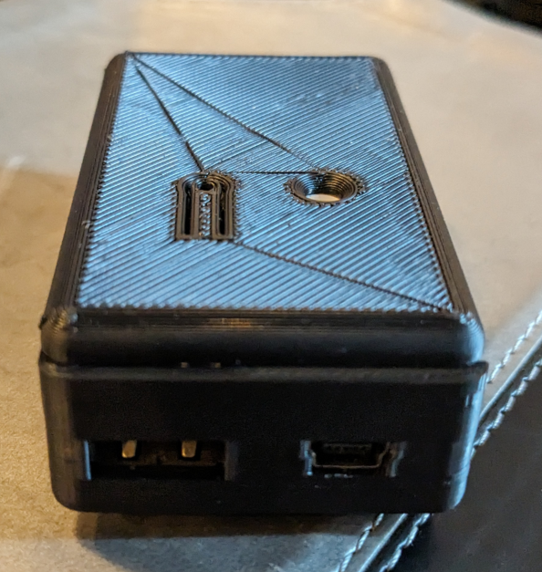

# RTX V2 - Amir Gorkovchenko (2021 - 2022)

## !! NEEDS UPDATE TO V3 !! 

### Changes from V1
 - re-freshed, re-documented, core bug fixes
 - everything packaged into portable libraries
 - new features added

### TODO - V3
 - Expand protocol to other processors.
 - boost bandwidth for more slave devices and packet resilience (re-transmission, packet ID-ing)
 - implement error correction
 - add wireless capabilities
 - upgrade to ESP32 for ATEM communication (Atmega328p is limiting)

### (RTX) Receive-Transmit-Exchange
Control Camera switching and Tally lights via a custom one-wire(RTX) protocol.
Expands flexibility and resilience from V1. Code is redesigned from ground up to reduce bugs and implement more redundant systems.

The one-wire protocol is designed to run on a single category(cat5) cable carrying the one-wire bus signal and 12v power supply.
This V2 protocol has been successfully tested over 200ft. (faster and more reliable protocols have been tested but not implemented)

All code runs on Atmega328p processors and can be compiled using Arduino IDE

## Each branch denotes a different device with a specialized purpose in the custom network with exceptions (CORE_Code, DEV_Code)

### ATEM_COMPANION_ETHERNET:
Communicates with ATEM video switchers to retrieve tally status'. Has capability to control ATEM (upgraded from V1)
Controls BitFocus Companion simultaneously using a cheap enc28j60 module rather than the easier but more expensive w5x00 modules.

Network configuration is completely stored on EEPROM and can be changed remotely using GUI_Serial

### RTX_CENTER_SIDE_SWITCHER
These devices are located at the cameras were they can be used to control cameras or give tally status'.

Named Center-Side-Switcher because we primarily have a center and side camera.

These devices get communication from the one-wire bus wire and power from the 12v provided by the same cable.

These devices have been upgraded to neopixels with one builtin and one external. One is built into the device for connection and device status and button mode.
The second LED is external for the tally light located on the Camera's carried by an AUX cable.
Both LED set's will flash special sequences of codes if it encounters certain EEPROM errors or connection issues

These devices each have the ability to connect to external buttons (a tri-foot-pedal in our case) with each button programed to different macros.
An extra auxiliary button was implemented for more flexibility.

All buttons and LED modes and tally lights can be programed remotely using GUI_Serial through EEPROM configuration

### RTX_GUI_SERIAL
GUI (General User Interface) through Serial communication

This device acts as a bridge between the computer and the one-wire network and allows for extensive configuration for Center-Side-Switcher devices without re-flashing the devices.
The both RTX_CENTER_SIDE_SWITCHER and ATEM_COMPANION_ETHERNET are completely configurable through this device. each are configured through their EEPROM and include an integrity check on boot-up

Certain diagnostic tools are included for debugging the network

### RTX_GUI
GUI (Graphical User Interface) experimental

This device was meant to supersede GUI_SERIAL as it would be combined with a java based program to give a user friendly interface for debugging and configuration

not enough need arose for this branch and is stalled

### RTX_MASTER_INTERFACE
This is the master device that connects to the one-wire network and facilitates communication between slave devices.
Only one is needed per network. This provides reliable packet delivery between devices, even if receiver is busy.

### CORE_CODE
This is the collection of all developed core libraries and classes. 

### DEV_Code
Extra development code

## Photos
### V1 old CENTER_SIDE_SWITCHER Box (one was for center camera, one was for side camera):

\
\
### V2 CENTER_SIDE_SWITCHER. Custom 3D printed case for a cleaner look and robust design:

### Ethernet Interface (top), Master Interface (bottom):

### Ethernet Interface EEPROM configuration map:

### Center-Side EEPROM configuration map:

### V3 experimental testing (200ft) range and max bandwidth. Test resulted in very reliable signal integrity and more than double of V2 Speeds:

\

Note typo, (6.298 KB/s, not 6298 KB/s). Ran 32.9 seconds, transferred 207k bytes without drops over 200ft. No error correction implemented:

#### RTX V2 Development
